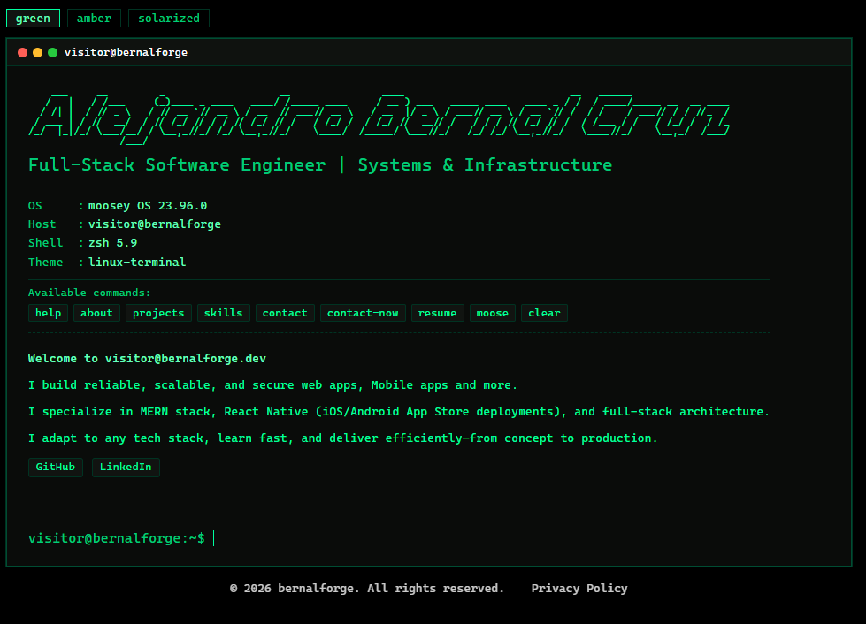
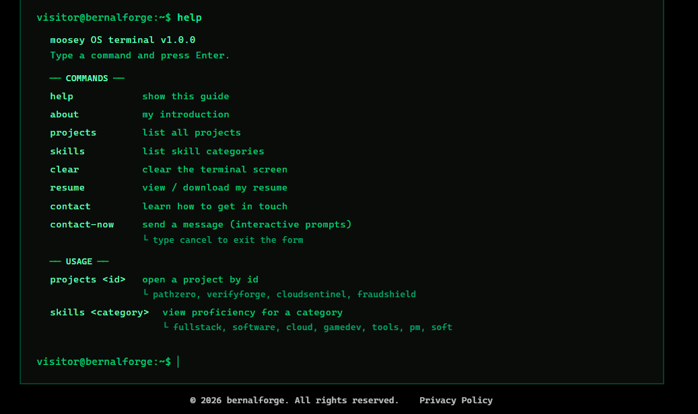

# 🐧 Moosey OS — A Linux-Style Interactive Portfolio

Welcome to **Moosey OS** — my personal take on the portfolio. I built this to showcase my passion for programming, distinctive user interfaces, and command-line environments. Rather than a typical portfolio site, Moosey OS is a fully-functional terminal-style experience where you explore my projects, skills, and ways to connect by typing real commands. It's a love letter to CLI design, built with React, TypeScript, and Vite for blazing-fast performance.

<div align="center">



_The Moosey OS interactive terminal—type commands to explore the portfolio_

</div>

> **What is this?** Instead of scrolling through a traditional portfolio, Moosey OS lets you _interact_ with it like a real terminal. Type `help` to see all commands, `projects pathzero` to explore a specific project, or `contact-now` to reach out directly.

## ✨ Key Features

- **Command-Based Interface** - Type real commands like `help`, `projects`, `skills`, `contact` to explore
- **Terminal-Inspired Design** - Authentic Linux/CLI aesthetic with ASCII art typography (Figlet)
- **Dark/Light Theme** - Toggle between themes for comfortable viewing any time
- **Lightning Fast** - Built with Vite for instant page loads and smooth animations (Framer Motion)
- **Fully Responsive** - Works flawlessly on desktop, tablet, and mobile
- **Interactive & Engaging** - Real terminal behavior to make exploring your portfolio fun

## ⌨️ How It Works

**Moosey OS v1.0** operates like a real terminal. Type commands and press Enter to interact with my portfolio.

<div align="center">



_Browse available commands using the `help` command_

</div>
### Available Commands

| Command             | Description                      | Example             |
| ------------------- | -------------------------------- | ------------------- |
| `help`              | Show all available commands      | `help`              |
| `about`             | Learn about me and my background | `about`             |
| `projects <id>`     | View a specific project          | `projects pathzero` |
| `projects`          | List all projects                | `projects`          |
| `skills <category>` | View skills by category          | `skills cloud`      |
| `skills`            | List all skill categories        | `skills`            |
| `resume`            | View or download resume          | `resume`            |
| `contact`           | Get contact information          | `contact`           |
| `contact-now`       | Open interactive contact form    | `contact-now`       |
| `clear`             | Clear the terminal screen        | `clear`             |

**Try it out:** Type `help` when you visit to see this in action!

### v1.0 Feature Set

- ✅ Full command-line interface with real argument parsing
- ✅ Interactive contact form with real-time validation
- ✅ Project showcase with filtering by ID
- ✅ Skill categories with detailed proficiency levels
- ✅ Responsive terminal layout
- ✅ Light/Dark theme persistence
- 🔜 **Coming Soon:** More terminal features for even more natural CLI behavior

## 🛠 Tech Stack

| Category         | Technology                      |
| ---------------- | ------------------------------- |
| **Framework**    | React 19 with TypeScript        |
| **Build Tool**   | Vite 8                          |
| **Routing**      | React Router v7                 |
| **Animations**   | Framer Motion                   |
| **Typography**   | Figlet (ASCII art generation)   |
| **Styling**      | CSS3 with custom theme system   |
| **Code Quality** | ESLint + TypeScript strict mode |
| **Dev Server**   | Vite HMR for instant updates    |

All dependencies are carefully chosen to maintain performance and minimize bundle size.

## 🚀 Quick Start

### Prerequisites

- Node.js 18+
- npm or yarn

### Installation

```bash
# Clone the repository
git clone https://github.com/Alejandro-Bernal/alexb-portfolio.git
cd linux-style-portfolio

# Install dependencies
npm install
```

### Development

```bash
# Start the dev server (opens http://localhost:5173)
npm run dev
```

### Production

```bash
# Build for production
npm run build

# Preview the production build
npm run preview
```

### Code Quality

```bash
# Run ESLint to check code quality
npm run lint
```

## 📁 Project Structure

```
src/
├── components/              # Reusable React components
│   ├── hero/               # Hero section & ASCII art banner
│   ├── Footer/             # Footer with copyright
│   └── terminal-commands/  # Terminal command handlers
│       ├── About/          # About command
│       ├── Contact/        # Contact info & form
│       ├── Help/           # Help command output
│       ├── Projects/       # Projects showcase
│       ├── Resume/         # Resume display
│       ├── Skills/         # Skills by category
│       ├── Neofetch/       # System info display
│       └── shared/         # Shared terminal components
├── hooks/                  # Custom React hooks (terminal, theme, effects)
├── context/                # React Context API (theme management)
├── services/               # Business logic & utilities
├── types/                  # TypeScript type definitions
└── App.tsx                 # Main application component
```

## 🎨 Customization

The portfolio uses a centralized theme system for easy customization:

- **Colors & Theme:** Edit [src/context/themeContext.ts](src/context/themeContext.ts)
- **Styling:** Modify component CSS files in [src/components/](src/components/)
- **Commands & Data:** Update command logic in [src/components/terminal-commands/](src/components/terminal-commands/)

## 📝 License

MIT License - feel free to use this as a template for your own portfolio!

## 👤 About

**Alejandro Bernal**

- 🔗 Portfolio: Visit [Moosey OS](https://your-portfolio-url.com)
- 💻 GitHub: [@Alejandro-Bernal](https://github.com/Alejandro-Bernal)
- 📧 Let's connect—try the `contact` command!

---

**Moosey OS v1.0** — Built with ❤️ using React, TypeScript, and a love for terminal interfaces.

_Have feedback or found a bug? Open an issue or submit a PR!_
